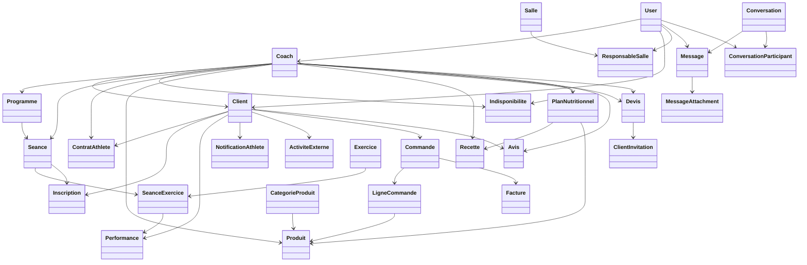

# Modèle de données - Athlo

Ce document décrit le modèle de données de la plateforme Athlo.
Il est basé sur les modèles Django définis dans `core/models.py`.

---

## Vue d'ensemble

Le système repose sur **cinq types de profils** utilisateurs construits sur le modèle `User` de Django :

- **Coach** : gestionnaire de l'activité (clients, séances, programmes, boutique)
- **Client (Athlète)** : utilisateur suivi par un coach
- **Prospect** : utilisateur sans profil, en phase de découverte
- **ResponsableSalle** : superviseur d'une salle de sport
- **Admin** : superutilisateur Django (gestion globale)

Le système gère : programmes d'entraînement, séances, exercices, performances, inscriptions, contrats, paiements Stripe, messagerie interne, notifications, boutique, nutrition, intégrations externes (Strava, Google Calendar) et facturation PDF.

---

## Entités principales

### User

Utilisateur de base géré par Django (`django.contrib.auth`). Chaque utilisateur possède au maximum un profil parmi : `Coach`, `Client` ou `ResponsableSalle`.

---

### Coach

Profil d'un coach sportif, lié à un `User` par une relation OneToOne.

| Champ | Type | Description |
| ----- | ---- | ----------- |
| `user` | OneToOne → User | Compte d'authentification |
| `platform_plan` | CharField | Plan abonnement : `free` ou `premium` |
| `stripe_customer_id` | CharField | ID client Stripe |
| `stripe_subscription_id` | CharField | ID abonnement Stripe premium |
| `stripe_account_id` | CharField | ID compte Stripe Connect (reversements) |
| `telephone` | CharField | Numéro de téléphone |
| `specialite` | CharField | Spécialité principale |
| `ville` | CharField | Ville d'exercice |
| `specialites_tags` | JSON | Liste de tags de spécialités |
| `offres_tarifs` | JSON | Tarifs proposés (séance, pack, abonnement) |
| `salles` | ManyToMany → Salle | Salles de sport affiliées |
| `google_access_token` | TextField | Token d'accès Google Calendar |
| `google_refresh_token` | TextField | Token de rafraîchissement Google Calendar |
| `google_token_expires_at` | DateTimeField | Expiration du token Google |

---

### Client (Athlète)

Profil d'un athlète suivi par un coach.

| Champ | Type | Description |
| ----- | ---- | ----------- |
| `user` | OneToOne → User | Compte d'authentification |
| `coach` | ForeignKey → Coach | Coach référent (nullable) |
| `nom` / `prenom` | CharField | Identité |
| `email` / `telephone` | CharField | Coordonnées |
| `date_naissance` / `age` | Date/Int | Date de naissance et âge |
| `taille` / `poids` | FloatField | Données physiques (cm / kg) |
| `genre` | CharField | Genre |
| `niveau_activite` | CharField | Niveau d'activité (sédentaire, modéré...) |
| `poids_cible` | FloatField | Objectif de poids |
| `type_entrainement` | CharField | Type d'entraînement souhaité |
| `objectifs_sportifs` | TextField | Objectifs personnels |
| `pathologies_blessures` | TextField | Antécédents médicaux |
| `consentement_rgpd` | BooleanField | Consentement RGPD |
| `est_archive` | BooleanField | Athlète archivé (inactif) |
| `tags` | CharField | Tags libres |
| `seances_restantes` | IntegerField | Crédits de séances disponibles |
| `onboarding_data` | JSON | Données du parcours d'inscription |
| `strava_access_token` | TextField | Token Strava |
| `strava_refresh_token` | TextField | Token de refresh Strava |
| `strava_athlete_id` | CharField | ID athlète Strava |
| `garmin_access_token` | TextField | Token Garmin |
| `garmin_refresh_token` | TextField | Token de refresh Garmin |

---

### Exercice

Définition d'un exercice sportif.

| Champ | Type | Description |
| ----- | ---- | ----------- |
| `nom` | CharField | Nom de l'exercice |
| `description` | TextField | Description |
| `categorie` | CharField | Catégorie : `Force`, `Cardio`, `Souplesse`, `Altero`, `Gym` |
| `muscle_principal` | CharField | Groupe musculaire principal |
| `video_url` | URLField | Lien vers une vidéo de démonstration |

---

### Programme

Programme d'entraînement créé par un coach.

| Champ | Type | Description |
| ----- | ---- | ----------- |
| `titre` | CharField | Intitulé du programme |
| `description` | TextField | Détail du programme |
| `coach` | ForeignKey → Coach | Coach créateur |
| `athlete` | ForeignKey → Client | Athlète assigné (nullable) |
| `date_debut` / `date_fin` | DateField | Période du programme |

---

### Seance

Séance d'entraînement planifiée par un coach.

| Champ | Type | Description |
| ----- | ---- | ----------- |
| `titre` | CharField | Titre de la séance |
| `coach` | ForeignKey → Coach | Coach animateur |
| `programme` | ForeignKey → Programme | Programme associé (nullable) |
| `salle` | ForeignKey → Salle | Lieu de la séance (nullable) |
| `jour_prevu` | DateField | Date de la séance |
| `heure_debut` / `heure_fin` | TimeField | Horaires |
| `capacite_max` | IntegerField | Nombre maximum de participants |
| `est_collective` | BooleanField | Séance collective ou individuelle |
| `est_completee` | BooleanField | Séance réalisée |
| `google_event_id` | CharField | ID de l'événement Google Calendar synchronisé |

---

### SeanceExercice

Détail d'un exercice au sein d'une séance (relation entre `Seance` et `Exercice`).

| Champ | Type | Description |
| ----- | ---- | ----------- |
| `seance` | ForeignKey → Seance | Séance parente |
| `exercice` | ForeignKey → Exercice | Exercice concerné |
| `series` | IntegerField | Nombre de séries |
| `repetitions` | IntegerField | Nombre de répétitions |
| `poids` | FloatField | Charge (kg) |
| `repos` | IntegerField | Temps de repos (secondes) |
| `ordre` | IntegerField | Position dans la séance |

---

### Performance

Résultats réalisés par un athlète pour un exercice d'une séance.

| Champ | Type | Description |
| ----- | ---- | ----------- |
| `client` | ForeignKey → Client | Athlète |
| `seance_exercice` | ForeignKey → SeanceExercice | Exercice de référence |
| `series_realisees` | IntegerField | Séries effectuées |
| `reps_realisees` | IntegerField | Répétitions réalisées |
| `poids_utilise` | FloatField | Poids utilisé (kg) |
| `notes_athlete` | TextField | Notes libres de l'athlète |

---

### Inscription

Participation d'un athlète à une séance.

| Champ | Type | Description |
| ----- | ---- | ----------- |
| `seance` | ForeignKey → Seance | Séance |
| `client` | ForeignKey → Client | Athlète |
| `statut` | CharField | `CONFIRME`, `ATTENTE`, `ANNULE`, `PRESENT`, `ABSENT` |
| `date_inscription` | DateTimeField | Date de l'inscription |

---

### Indisponibilite

Créneau d'indisponibilité ou de congé d'un coach.

| Champ | Type | Description |
| ----- | ---- | ----------- |
| `coach` | ForeignKey → Coach | Coach concerné |
| `titre` | CharField | Libellé (ex : Vacances, Formation) |
| `jour_prevu` | DateField | Date |
| `heure_debut` / `heure_fin` | TimeField | Plage horaire |
| `est_conge` | BooleanField | Journée complète (congé) |
| `google_event_id` | CharField | ID de l'événement Google Calendar |

---

### Salle

Lieu physique d'entraînement.

| Champ | Type | Description |
| ----- | ---- | ----------- |
| `nom` | CharField | Nom de la salle |
| `adresse` | CharField | Adresse postale |
| `ville` | CharField | Ville |
| `latitude` / `longitude` | FloatField | Coordonnées GPS |
| `coachs_bannis` | ManyToMany → Coach | Coachs exclus de la salle |

---

### ResponsableSalle

Profil d'un responsable de salle de sport.

| Champ | Type | Description |
| ----- | ---- | ----------- |
| `user` | OneToOne → User | Compte d'authentification |
| `salle` | ForeignKey → Salle | Salle supervisée |
| `telephone` | CharField | Numéro de téléphone |

---

### ContratAthlete

Contrat liant un athlète à un coach (abonnement, pack ou séance unique).

| Champ | Type | Description |
| ----- | ---- | ----------- |
| `client` | ForeignKey → Client | Athlète |
| `coach` | ForeignKey → Coach | Coach |
| `type_contrat` | CharField | `ABONNEMENT`, `PACK`, `UNITE` |
| `statut` | CharField | `ACTIF`, `EXPIRE`, `ANNULE` |
| `date_debut` / `date_expiration` | DateField | Période de validité |
| `seances_total` | IntegerField | Total de séances incluses |
| `seances_restantes` | IntegerField | Séances restantes à utiliser |
| `montant_ttc` | DecimalField | Montant payé TTC |
| `stripe_payment_intent_id` | CharField | Référence du paiement Stripe |

---

### ClientInvitation

Invitation envoyée par un coach à un prospect pour acheter une offre.

| Champ | Type | Description |
| ----- | ---- | ----------- |
| `coach` | ForeignKey → Coach | Coach invitant |
| `client` | ForeignKey → Client | Client cible (nullable avant activation) |
| `token` | CharField | Jeton unique d'invitation |
| `email` / `phone` | CharField | Coordonnées de l'invité |
| `offer_type` | CharField | Type d'offre proposée |
| `offer_label` | CharField | Libellé de l'offre |
| `amount` | DecimalField | Montant de l'offre |
| `status` | CharField | `pending`, `paid`, `activated` |
| `paid_at` | DateTimeField | Date du paiement |
| `activated_at` | DateTimeField | Date d'activation du compte |

---

### ActiviteExterne

Activité sportive importée depuis Strava ou Garmin.

| Champ | Type | Description |
| ----- | ---- | ----------- |
| `client` | ForeignKey → Client | Athlète |
| `plateforme` | CharField | `STRAVA` ou `GARMIN` |
| `external_id` | CharField | ID de l'activité sur la plateforme source |
| `nom` | CharField | Nom de l'activité |
| `type_activite` | CharField | Type (course, vélo, natation...) |
| `date_debut` | DateTimeField | Date et heure de début |
| `distance_metres` | FloatField | Distance parcourue (mètres) |
| `temps_secondes` | IntegerField | Durée (secondes) |
| `calories` | IntegerField | Calories brûlées |
| `frequence_cardiaque_moyenne` | IntegerField | FC moyenne (bpm) |
| `donnees_brutes` | JSON | Données brutes complètes de l'API |

---

### Messagerie

**Conversation** — fil de discussion (direct ou groupe).

| Champ | Type | Description |
| ----- | ---- | ----------- |
| `conversation_type` | CharField | `direct` ou `group` |
| `title` | CharField | Titre (pour les groupes) |
| `created_by` | ForeignKey → User | Créateur |

**ConversationParticipant** — lien entre un utilisateur et une conversation.

| Champ | Type | Description |
| ----- | ---- | ----------- |
| `conversation` | ForeignKey → Conversation | Conversation |
| `user` | ForeignKey → User | Participant |
| `last_read_at` | DateTimeField | Dernière lecture |

**Message** — message dans une conversation.

| Champ | Type | Description |
| ----- | ---- | ----------- |
| `conversation` | ForeignKey → Conversation | Conversation parente |
| `sender` | ForeignKey → User | Expéditeur |
| `content` | TextField | Contenu textuel |
| `is_deleted` | BooleanField | Message supprimé |

**MessageAttachment** — pièce jointe d'un message.

| Champ | Type | Description |
| ----- | ---- | ----------- |
| `message` | ForeignKey → Message | Message parent |
| `file` | FileField | Fichier uploadé |
| `original_name` | CharField | Nom original du fichier |

---

### Notifications

**Notification (coach)** — notification envoyée à un coach.

| Champ | Type | Description |
| ----- | ---- | ----------- |
| `coach` | ForeignKey → Coach | Coach destinataire (nullable) |
| `seance` | ForeignKey → Seance | Séance concernée (nullable) |
| `message` | TextField | Contenu de la notification |
| `type` | CharField | `INSCRIPTION`, `DESINSCRIPTION`, `ANNULATION`, `MODIFICATION`, `INFO`, `PAIEMENT` |
| `est_lu` | BooleanField | Marquée comme lue |

**NotificationAthlete** — notification envoyée à un athlète.

| Champ | Type | Description |
| ----- | ---- | ----------- |
| `client` | ForeignKey → Client | Athlète destinataire (nullable) |
| `message` | TextField | Contenu |
| `type` | CharField | `SEANCE`, `RAPPEL`, `OBJECTIF`, `INFO` |
| `est_lu` | BooleanField | Marquée comme lue |

**NotificationResponsable** — notification envoyée à un responsable de salle.

| Champ | Type | Description |
| ----- | ---- | ----------- |
| `responsable` | ForeignKey → ResponsableSalle | Responsable destinataire |
| `message` | TextField | Contenu |
| `type` | CharField | `SEANCE`, `COACH`, `SALLE`, `URGENT`, `INFO` |
| `est_lu` | BooleanField | Marquée comme lue |

---

### Boutique

**CategorieProduit** — catégorie de produit.

| Champ | Type | Description |
| ----- | ---- | ----------- |
| `nom` | CharField | Nom de la catégorie |
| `slug` | SlugField | Identifiant URL |

**Produit** — produit de la boutique d'un coach.

| Champ | Type | Description |
| ----- | ---- | ----------- |
| `coach` | ForeignKey → Coach | Coach vendeur |
| `nom` | CharField | Nom du produit |
| `description` | TextField | Description |
| `prix` | DecimalField | Prix unitaire |
| `image` | ImageField | Photo du produit |
| `categorie` | ForeignKey → CategorieProduit | Catégorie |
| `type_produit` | CharField | `PHYSIQUE` ou `NUMERIQUE` |
| `stock` | IntegerField | Quantité disponible |
| `est_actif` | BooleanField | Produit visible |
| `peut_etre_livre` / `peut_etre_retire` | BooleanField | Options de livraison |

**Commande** — commande passée par un athlète.

| Champ | Type | Description |
| ----- | ---- | ----------- |
| `client` | ForeignKey → Client | Acheteur |
| `coach` | ForeignKey → Coach | Vendeur (nullable) |
| `order_number` | CharField | Numéro de commande unique |
| `offre_label` / `offre_type` | CharField | Libellé et type de l'offre |
| `montant_ht` | DecimalField | Montant HT |
| `tva_taux` | DecimalField | Taux de TVA |
| `montant_ttc` | DecimalField | Montant TTC |
| `frais_livraison` | DecimalField | Frais de livraison |
| `status` | CharField | `PENDING`, `PAID`, `FAILED`, `EXPEDIEE`, `LIVREE`, `ANNULEE` |
| `stripe_payment_intent_id` | CharField | Référence Stripe |
| `adresse_livraison` | TextField | Adresse de livraison (JSON) |

**LigneCommande** — ligne d'article dans une commande.

| Champ | Type | Description |
| ----- | ---- | ----------- |
| `commande` | ForeignKey → Commande | Commande parente |
| `produit` | ForeignKey → Produit | Produit commandé |
| `quantite` | IntegerField | Quantité |
| `prix_unitaire` | DecimalField | Prix unitaire au moment de l'achat |

**Facture** — facture PDF générée pour une commande.

| Champ | Type | Description |
| ----- | ---- | ----------- |
| `commande` | OneToOne → Commande | Commande facturée |
| `numero_facture` | CharField | Numéro unique |
| `date_emission` | DateField | Date d'émission |
| `pdf_file` | FileField | Fichier PDF généré (ReportLab) |

---

### Nutrition

**Recette** — recette créée par un coach.

| Champ | Type | Description |
| ----- | ---- | ----------- |
| `coach` | ForeignKey → Coach | Coach créateur |
| `nom` | CharField | Nom de la recette |
| `type` | CharField | `Petit-déjeuner`, `Déjeuner`, `Dîner`, `Collation`, `Pre-workout` |
| `calories` | IntegerField | Apport calorique |
| `proteines` / `glucides` / `lipides` | FloatField | Macronutriments (g) |
| `date_creation` | DateField | Date de création |

**PlanNutritionnel** — plan alimentaire compilant plusieurs recettes.

| Champ | Type | Description |
| ----- | ---- | ----------- |
| `coach` | ForeignKey → Coach | Coach créateur |
| `titre` | CharField | Titre du plan |
| `description` | TextField | Description |
| `prix` | DecimalField | Prix (si vendu en boutique) |
| `image` | ImageField | Visuel du plan |
| `recettes` | ManyToMany → Recette | Recettes incluses |
| `produit` | OneToOne → Produit | Produit boutique associé (nullable) |

---

### Autres entités

**Avis** — avis laissé par un client sur un coach.

| Champ | Type | Description |
| ----- | ---- | ----------- |
| `coach` | ForeignKey → Coach | Coach évalué |
| `client` | ForeignKey → Client | Client évaluateur |
| `note` | IntegerField | Note (1 à 5) |
| `commentaire` | TextField | Commentaire libre |

**Devis** — demande de devis envoyée par un prospect à un coach.

| Champ | Type | Description |
| ----- | ---- | ----------- |
| `coach` | ForeignKey → Coach | Coach destinataire |
| `prospect` | ForeignKey → User | Prospect demandeur (nullable) |
| `nom` / `prenom` / `email` / `telephone` | CharField | Coordonnées |
| `age` / `taille` / `poids` | Numeric | Données physiques |
| `niveau_activite` / `type_entrainement` | CharField | Profil sportif |
| `objectif_sportif` / `budget` | CharField | Objectifs et budget |
| `pathologies_blessures` | TextField | Antécédents médicaux |
| `message` | TextField | Message libre |
| `statut` | CharField | `en_attente`, `accepte`, `refuse` |
| `prix_propose` | DecimalField | Prix proposé par le coach |
| `invitation_liee` | ForeignKey → ClientInvitation | Invitation liée (si accepté) |

---

## Relations principales

```text
User ──── (1:1) ──── Coach
User ──── (1:1) ──── Client
User ──── (1:1) ──── ResponsableSalle

Coach ──── (1:N) ──── Client
Coach ──── (1:N) ──── Programme
Coach ──── (1:N) ──── Seance
Coach ──── (1:N) ──── Indisponibilite
Coach ──── (1:N) ──── ContratAthlete
Coach ──── (1:N) ──── Produit
Coach ──── (1:N) ──── Recette
Coach ──── (1:N) ──── PlanNutritionnel
Coach ──── (1:N) ──── Devis
Coach ──── (1:N) ──── Avis
Coach ──── (M:M) ──── Salle

Client ──── (1:N) ──── Inscription
Client ──── (1:N) ──── Performance
Client ──── (1:N) ──── NotificationAthlete
Client ──── (1:N) ──── ActiviteExterne
Client ──── (1:N) ──── Commande
Client ──── (1:N) ──── ContratAthlete

Programme ──── (1:N) ──── Seance
Seance ──── (1:N) ──── SeanceExercice
Seance ──── (1:N) ──── Inscription
Exercice ──── (1:N) ──── SeanceExercice
SeanceExercice ──── (1:N) ──── Performance

Commande ──── (1:N) ──── LigneCommande
Commande ──── (1:1) ──── Facture
LigneCommande ──── (N:1) ──── Produit

PlanNutritionnel ──── (M:M) ──── Recette
PlanNutritionnel ──── (1:1) ──── Produit

Conversation ──── (1:N) ──── ConversationParticipant
Conversation ──── (1:N) ──── Message
Message ──── (1:N) ──── MessageAttachment

ResponsableSalle ──── (N:1) ──── Salle
```

---

## Diagramme de classes (Mermaid)


