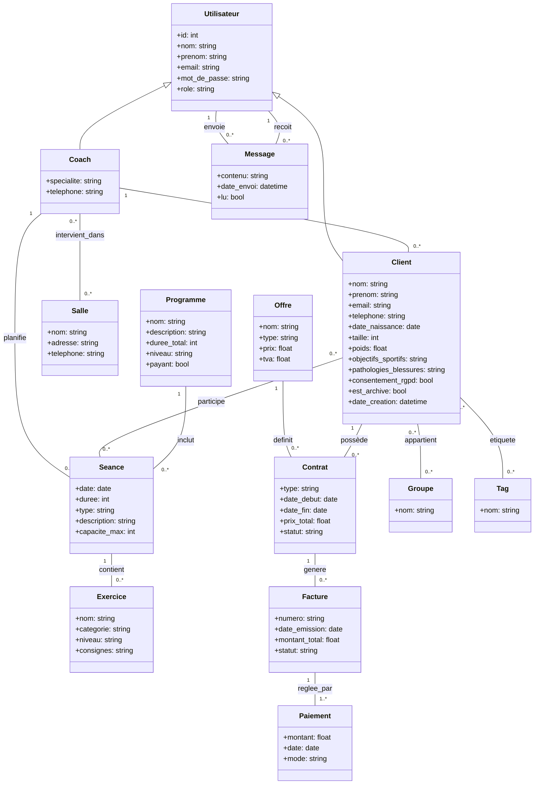

# Modèle de données

Ce diagramme représente les principales entités du système ArchiWeb 2026 et leurs relations, en cohérence avec l’expression de besoins du client.

## Description des entités principales

- **Utilisateur** : information de base (id, nom, prénom, email, mot de passe)
- **Coach** : spécialité, téléphone, clients associés
- **Client** : informations personnelles, objectifs sportifs, pathologies, contrats, groupes et tags
- **Séance** : date, durée, type, description, association à un ou plusieurs clients
- **Programme** : nom, description, durée totale, niveau, séances associées
- **Exercice** : nom, catégorie, niveau, consignes
- **Contrat** : type, date début/fin, prix, TVA, paiements associés
- **Paiement** : montant, date, mode
- **Groupe** : nom, clients associés
- **Tag** : nom, clients associés
- **Message** : contenu, expéditeur, destinataire(s), date

## Diagramme de classes
